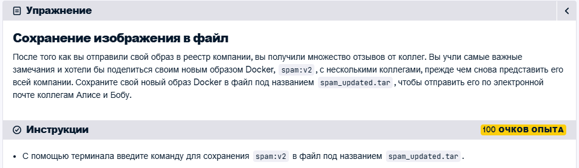
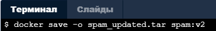
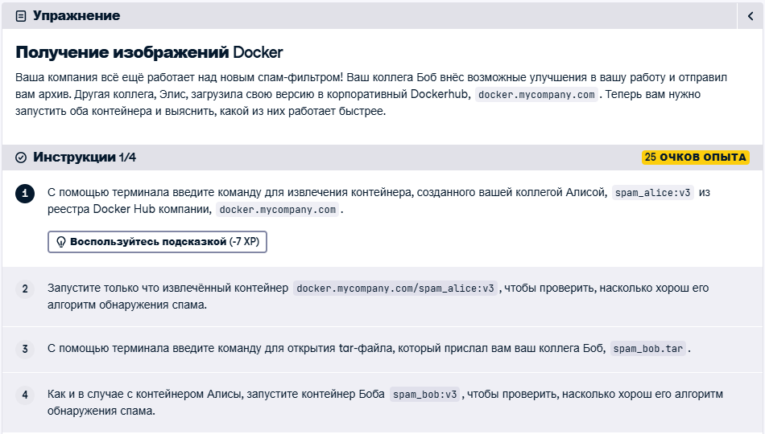
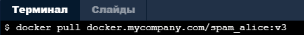
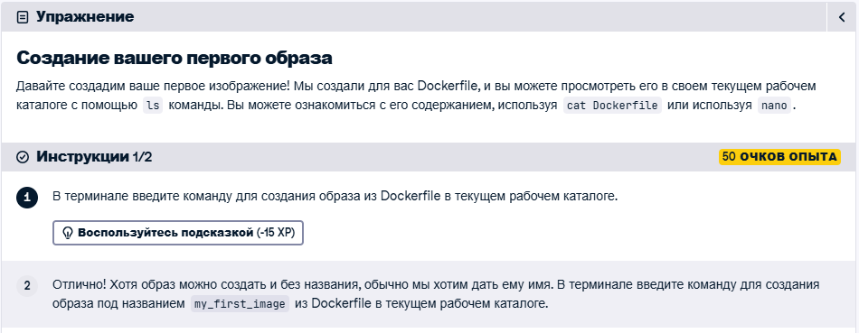
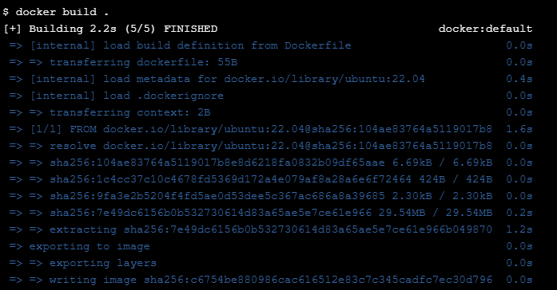
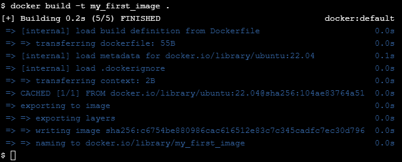
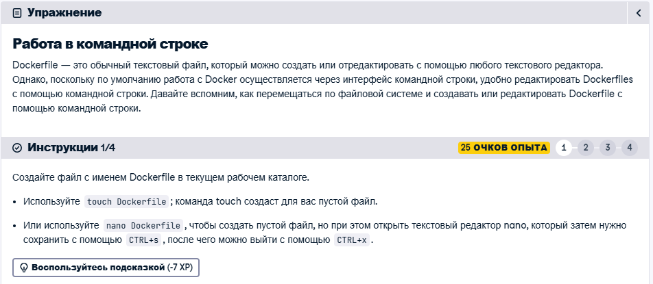
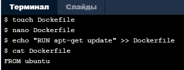
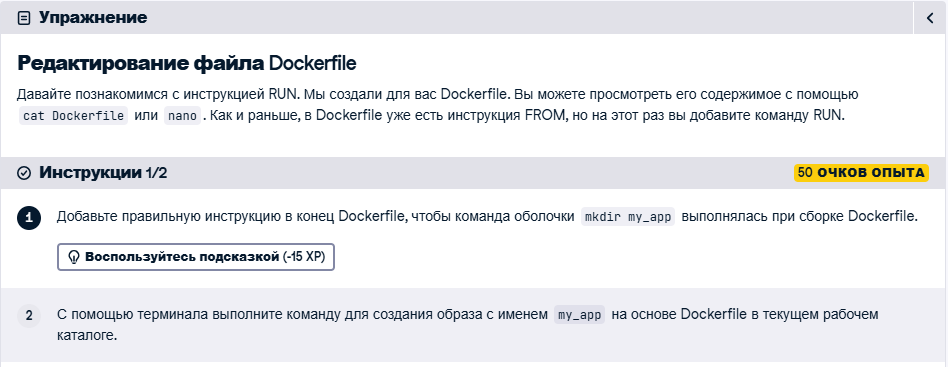

# Первое задание

Терминал в этом задании отказывается работать вовсе

# Второе задание

### Решение 

# Третье задание 

### Решение

1) Получаем контейнер созданный Алисой

2) Запускаем извлеченный контейнер

`docker run docker.mycompany.com/spam_alice:v3`

3) Открываем tar-файл

`docker load -i spam_bob.tar`

4) Запустим контейнер

`docker run spam_bob:v3`

# Четвертое задание

### Решение

1) Создаем образ

2) Создаем образ с нужным названием

# Пятое задание

(Полное описание всех 4 пунктов:)

- Давайте познакомимся с инструкцией RUN. Для вас уже создан Dockerfile. Вы можете посмотреть его содержимое с помощью cat Dockerfile или открыть в редакторе nano.

- Использование nano для редактирования файла часто является наиболее интуитивным способом. Однако вы также можете использовать echo в сочетании с двойной трубкой (>>) для добавления данных в файлы без их открытия. Давайте используем echo для добавления RUN apt-get update в наш Dockerfile.

- Проверьте содержимое файла Dockerfile с помощью cat команды, cat ожидающей имя файла в качестве первого и единственного аргумента.

### Решение

# Шестое задание

Решение

