# Первое задание 

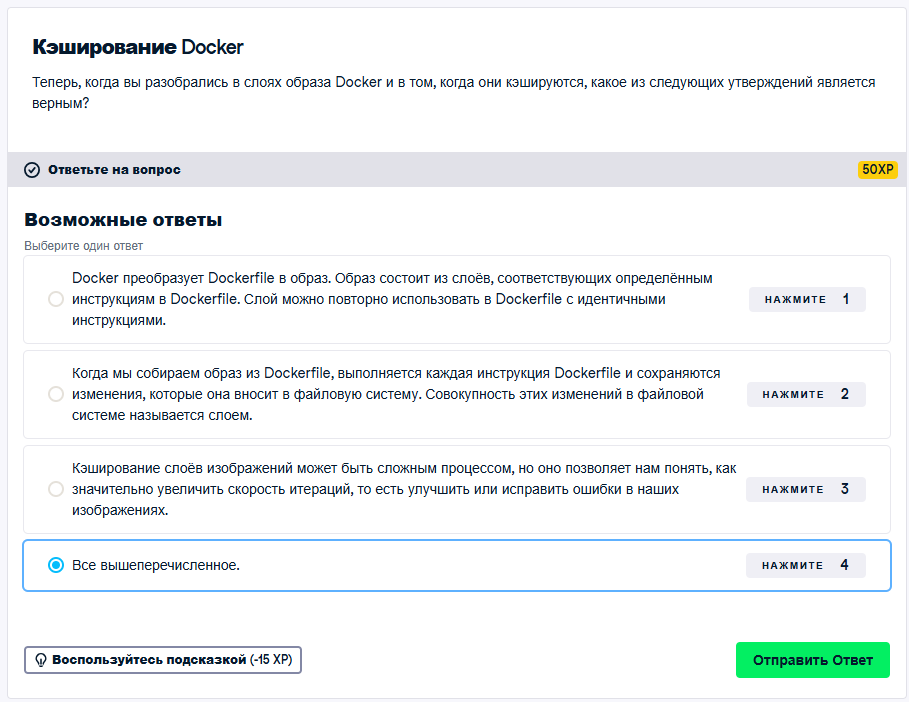

### Ответ: 4 - Все вышеперечисленное

# Второе задание

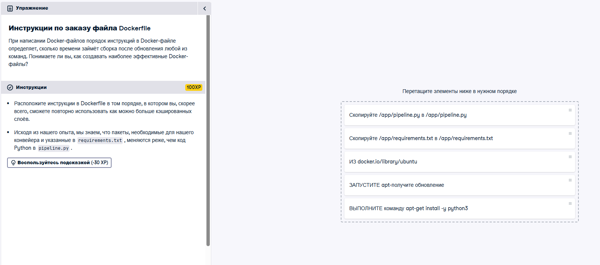

### Решение:

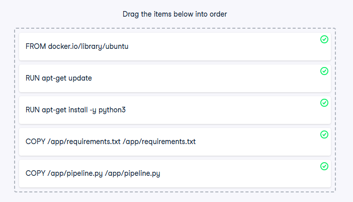

# Третье задание 

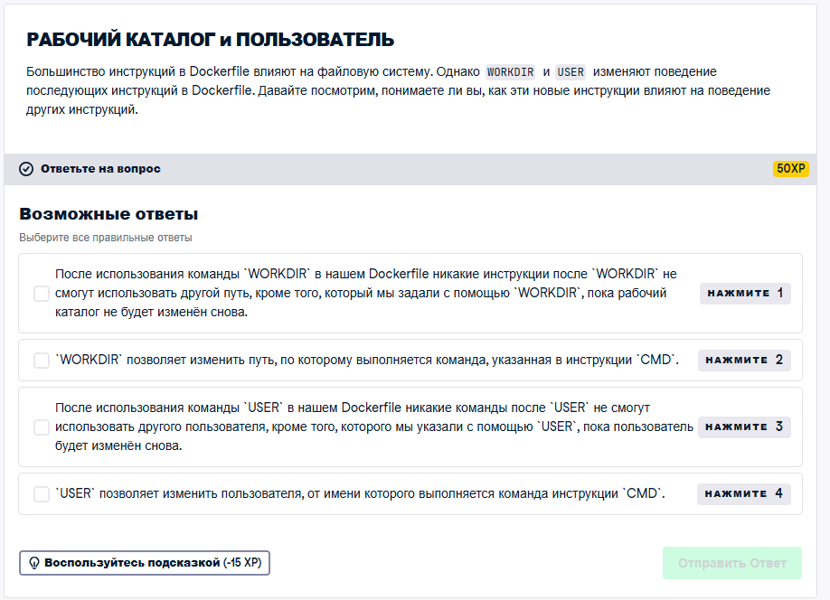

### Решение:

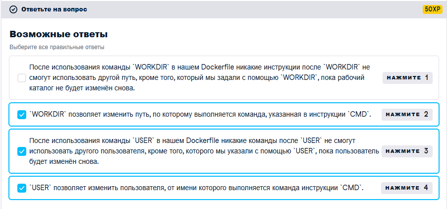

# Четвертое задание 

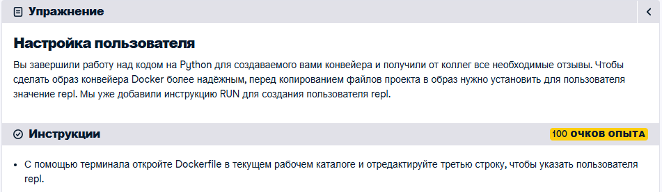

### Решение: 

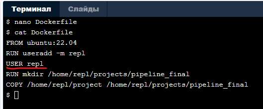

# Пятое задание

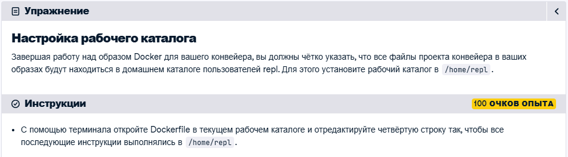

### Решение:

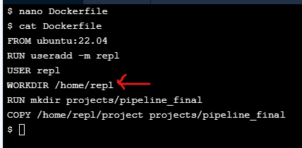

# Шестое задание

### Ответ: 

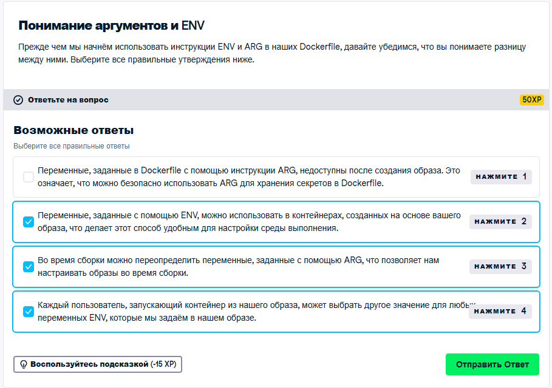

# Седьмое задание

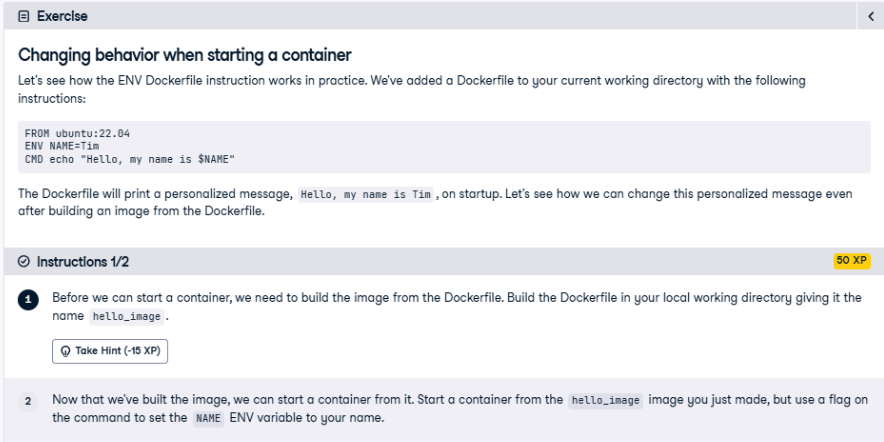 

### Решение:

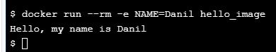

# Восьмое задание и ответ к нему:

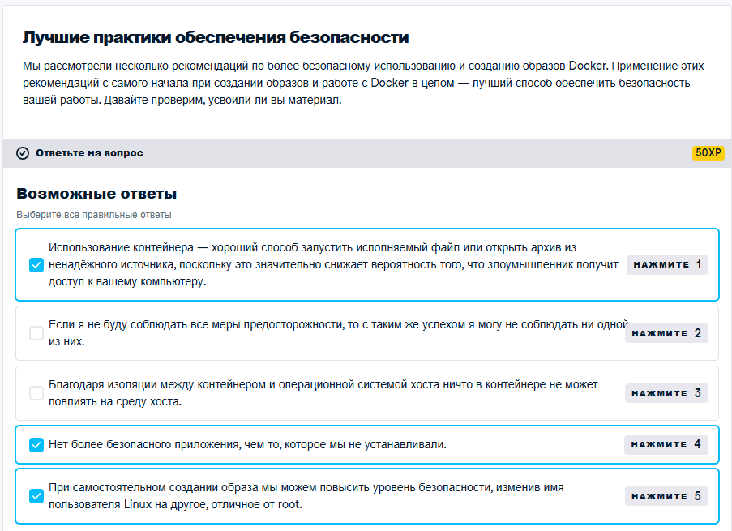

# ИТОГ.

# Было выполнено более 75% всех задач на этомм курсе. 
Большую часть 2-го раздела - терминал не работал.

# Набрано 1 990 / 3400 EXP (но стоит учитывать, что многие задания не засчитались, так как верные решения не проходили валидацию по странным причинам)

